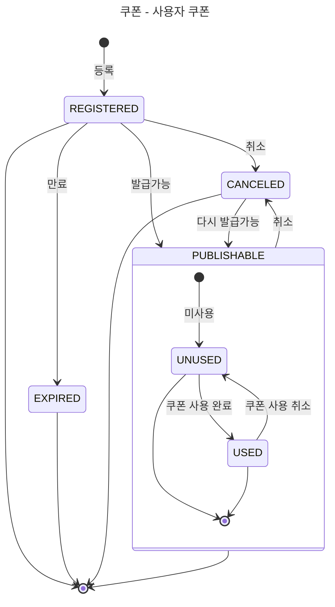
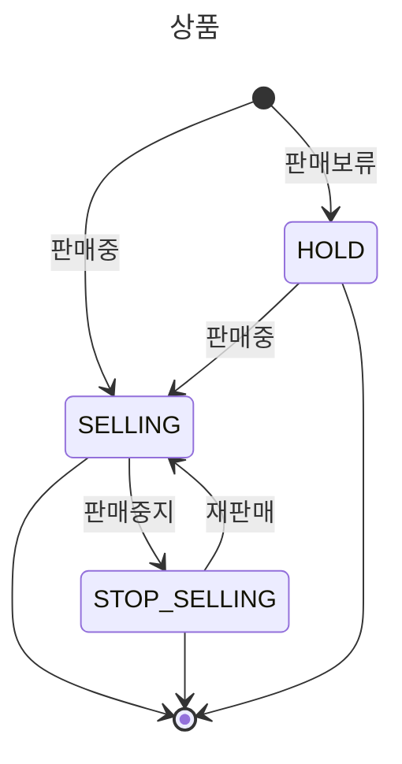
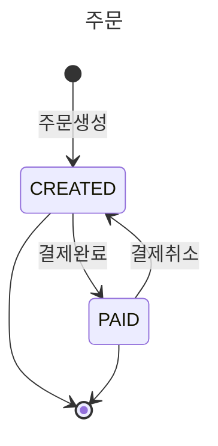

# E-커머스 상태 시퀀스 다이어그램

**📚 문서 목록**

+ [1️⃣ 요구사항 분석 문서](01.Requirements.md)
+ [2️⃣ 마일스톤 문서](02.Milestones.md)
+ [3️⃣ 다이어그램 문서]()
    + [시퀀스 다이어그램 문서](03-1.SequenceDiagram)
    + [상태 다이어그램 문서](03-2.StateDiagram.md)
+ [4️⃣ ERD 문서](04.ERD.md)
+ [5️⃣ API 명세](05.ApiDocument.md)

---

## 쿠폰 상태

### 설명 (Description)

**쿠폰**

+ `REGISTERED` : 관리자에 의해 쿠폰이 등록된다.
+ `EXPIRED` : 쿠폰 상태 값이 변하지는 않지만, 만료 기간이 넘으면 만료 상태로 간주한다.
+ `CANCELED` : 관리자에 쿠폰이 취소된다.
+ `PUBLISHABLE` : 쿠폰이 발급 가능한 상태를 말한다.

**사용자 쿠폰**

+ `UNUSED` : 쿠폰을 발급하면 미사용 상태로 발급이 된다.
+ `USED` : 주문 시, 결제 프로세스에서 쿠폰을 사용 완료하게 되면 **사용** 상태로 변경된다. 단, 결제가 취소되면 다시 **미사용** 상태로 롤백된다.

## 상품 상태

### 다이어그램 (Diagram)

### 설명 (Description)

**상품**

+ `HOLD` : 관리자에 의해 상품이 **보류** 상태로 등록된다.
+ `SELLING` : 관리자에 의해 상품이 **판매중** 상태로 등록되거나, 보류 상태에서 **판매중**으로 상태 변경이 일어날 수 있다.
+ `STOP_SELLING` : 판매중인 상품을 **판매중지** 상태로 변경할 수 있다. 다시 **판매중**상태로 변경이 가능하다.

## 주문 상태

### 다이어그램 (Diagram)

### 설명 (Description)

**주문**

+ `CREATED` : 사용자 주문/결제 요청 시, 주문 생성 조건을 만족하면 **주문생성** 상태로 등록된다.  
+ `PAID` : 주문 생성 후, 결제 프로세스(잔고 차감 / 쿠폰 사용 / 재고 차감)을 완료하면 **결제완료**로 변경된다. 
          단, 이 과정에서 결제취소로 인한 **주문생성**상태로 롤백 된다.