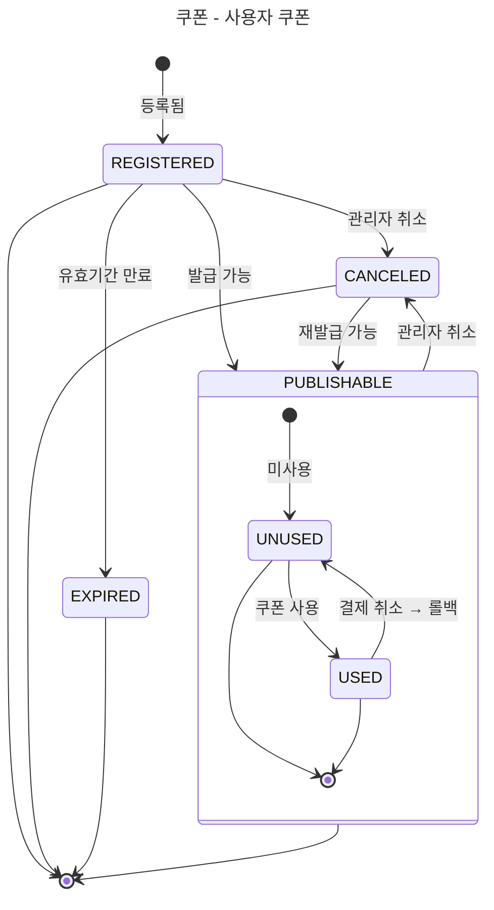
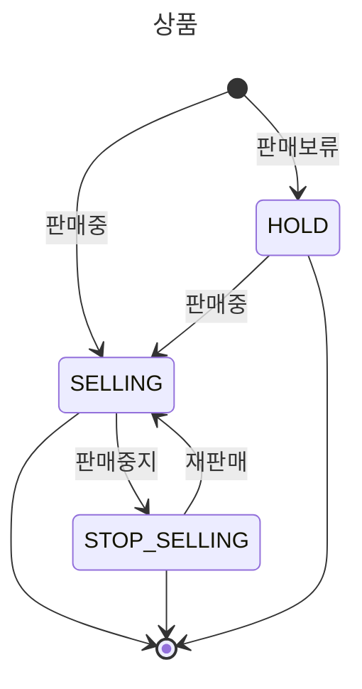
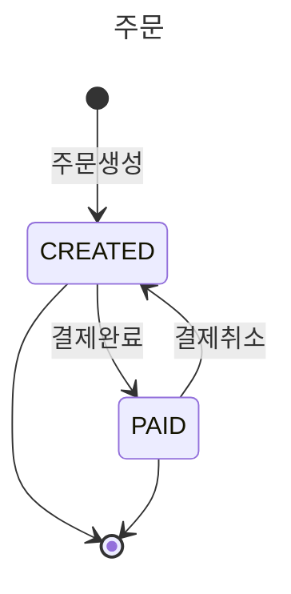

# E-커머스 상태 다이어그램

**📚 문서 목록**

+ [1️⃣ 요구사항 분석 문서](01.Requirements.md)
+ [2️⃣ 마일스톤 문서](02.Milestones.md)
+ 3️⃣ 다이어그램 문서
    + [시퀀스 다이어그램 문서](03-1.SequenceDiagram.md)
    + [상태 다이어그램 문서](03-2.StateDiagram.md)
+ [4️⃣ ERD 문서](04.ERD.md)
+ [5️⃣ API 명세](05.ApiDocument.md)

---

<!-- TOC -->
* [E-커머스 상태 다이어그램](#e-커머스-상태-다이어그램)
  * [쿠폰 상태](#쿠폰-상태)
    * [설명 (Description)](#설명-description)
  * [판매 상태](#판매-상태)
    * [다이어그램 (Diagram)](#다이어그램-diagram)
    * [설명 (Description)](#설명-description-1)
  * [주문 상태](#주문-상태)
    * [다이어그램 (Diagram)](#다이어그램-diagram-1)
    * [설명 (Description)](#설명-description-2)
<!-- TOC -->

## 쿠폰 상태

### 설명 (Description)

**쿠폰**

+ `REGISTERED` : 관리자에 의해 쿠폰이 등록된다.
+ `EXPIRED` : 쿠폰의 상태값은 유지되지만, 유효기간 초과 시 만료로 간주된다. (실제 발급/사용은 제한됨)
+ `CANCELED` : 관리자에 쿠폰이 취소된다.
+ `PUBLISHABLE` : 쿠폰이 발급 가능한 상태를 말한다.

**사용자 쿠폰**

+ `UNUSED` : 쿠폰을 발급하면 미사용 상태로 발급이 된다.
+ `USED` : 결제에 쿠폰이 적용되면 사용 완료 상태로 변경된다. 결제가 취소될 경우, 쿠폰은 다시 `UNUSED` 상태로 롤백된다.

## 판매 상태

### 다이어그램 (Diagram)

### 설명 (Description)

**상품**

+ `HOLD` : 상품이 등록되었지만 아직 판매가 보류된 상태로, 사용자에게 노출되지 않는다.
+ `SELLING` : 관리자에 의해 상품이 **판매중** 상태로 등록되거나, 보류 상태에서 **판매중**으로 상태 변경이 일어날 수 있다.
+ `STOP_SELLING` : 판매 중지된 상태이며, 관리자에 의해 다시 `SELLING` 상태로 변경될 수 있다.

## 주문 상태

### 다이어그램 (Diagram)

### 설명 (Description)

**주문**

+ `CREATED` : 사용자가 주문을 생성하면 결제 대기 상태로 진입한다.  
+ `PAID` : 결제가 정상적으로 완료된 상태이며, 이후 결제 취소 시 `CREATED` 상태로 되돌아간다.