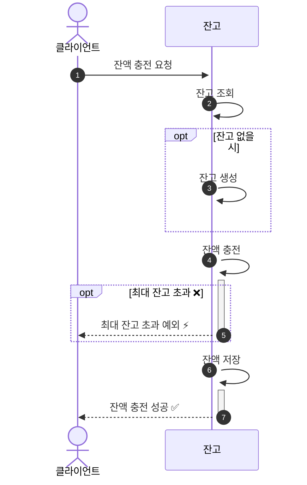
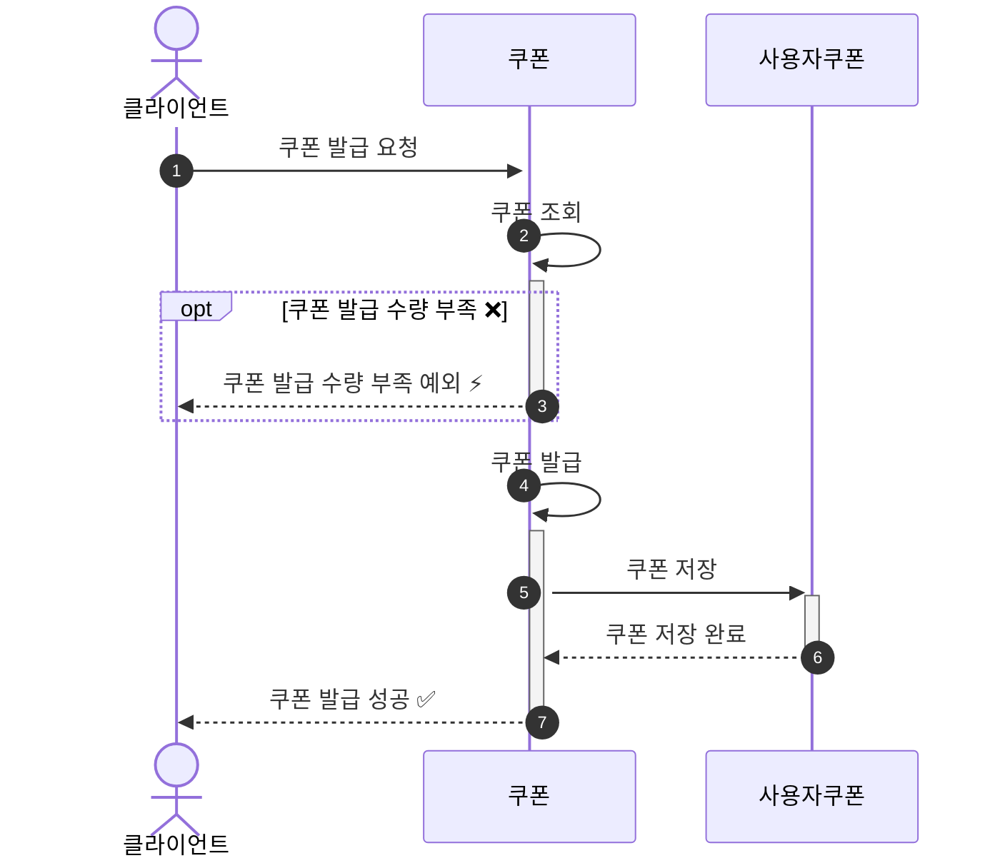
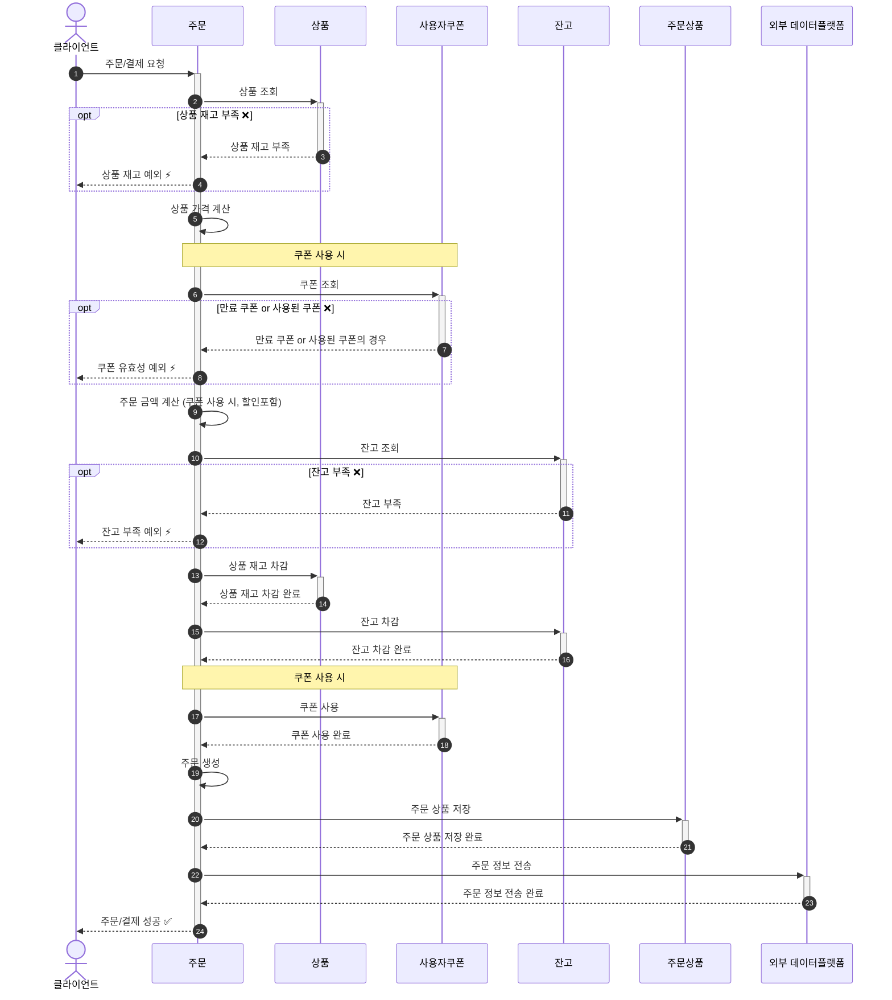
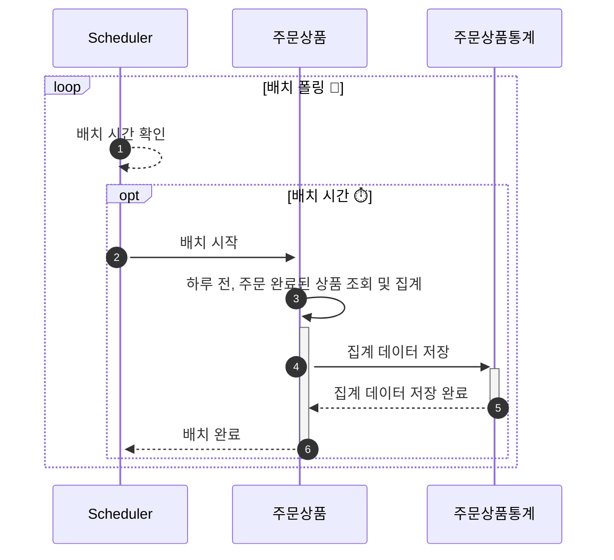

# E-커머스 서비스 시퀀스 다이어그램

**📚 문서 목록**

+ [1️⃣ 요구사항 분석 문서](01.Requirements.md)
+ [2️⃣ 마일스톤 문서](02.Milestones.md)
+ [3️⃣ 시퀀스 다이어그램 문서](03.SequenceDiagram.md)
+ [4️⃣ ERD 문서](04.ERD.md)
+ [5️⃣ API 명세](05.ApiDocument.md)

---

<!-- TOC -->
* [E-커머스 서비스 시퀀스 다이어그램](#e-커머스-서비스-시퀀스-다이어그램)
  * [잔액 충전](#잔액-충전)
  * [쿠폰 발급](#쿠폰-발급)
  * [주문 및 결제](#주문-및-결제)
  * [상위 상품 배치 스케줄러](#상위-상품-배치-스케줄러)
<!-- TOC -->

> 주요 로직에 대한 시퀀스 다이어그램 작성을 하였습니다. (단순 조회 기능의 경우 생략하였습니다.) 

## 잔액 충전

## 쿠폰 발급

## 주문 및 결제

## 상위 상품 배치 스케줄러

