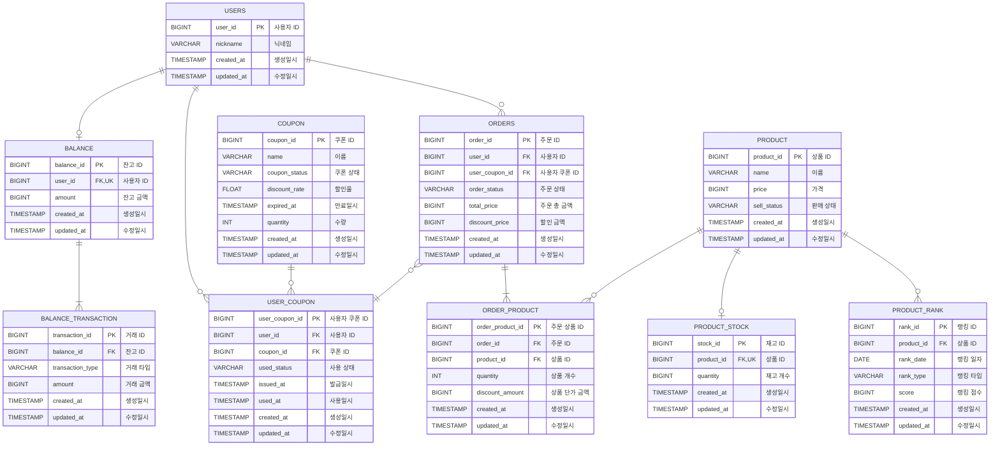

# E-커머스 서비스 ERD

**📚 문서 목록**

+ [1️⃣ 요구사항 분석 문서](01.Requirements.md)
+ [2️⃣ 마일스톤 문서](02.Milestones.md)
+ 3️⃣ 다이어그램 문서
    + [시퀀스 다이어그램 문서](03-1.SequenceDiagram.md)
    + [상태 다이어그램 문서](03-2.StateDiagram.md)
+ [4️⃣ ERD 문서](04.ERD.md)
+ [5️⃣ API 명세](05.ApiDocument.md)

---

<!-- TOC -->
* [E-커머스 서비스 ERD](#e-커머스-서비스-erd)
  * [의도 (Intent)](#의도-intent)
    * [테이블의 고유 식별자 구성](#테이블의-고유-식별자-구성)
    * [동시성 제어 컬럼](#동시성-제어-컬럼-)
    * [관리자 성격의 상태 컬럼](#관리자-성격의-상태-컬럼-)
  * [ERD 작성](#erd-작성)
  * [상태 및 타입 정의 (Status & Type)](#상태-및-타입-정의-status--type)
    * [거래 타입 (transaction_type)](#거래-타입-transaction_type)
    * [쿠폰 상태 (coupon_status)](#쿠폰-상태-coupon_status)
    * [사용 상태 (used_status)](#사용-상태-used_status)
    * [판매 상태 (sell_status)](#판매-상태-sell_status)
    * [랭크 타입 (rank_type)](#랭크-타입-rank_type)
    * [주문 상태 (order_status)](#주문-상태-order_status)
<!-- TOC -->

## 의도 (Intent)

### 테이블의 고유 식별자 구성

BALANCE, PRODUCT_STOCK 테이블은 USER, PRODUCT 등과 1:1 관계를 맺고 있어 외래 키를 기본 키로 사용할 수 있으나, 
도메인 독립성과 명확한 식별을 위해 별도의 ID 컬럼(고유 식별자)을 기본 키로 설계하였습니다.
다만, 이 경우 조인 시 인덱스 활용이 제한되어 쿼리 성능 측면에서 불리할 수 있습니다.

### 동시성 제어 컬럼 

BALANCE.amount, COUPON.quantity, PRODUCT_STOCK.quantity는 동시성 제어가 필요한 주요 컬럼으로,  
동시 요청에 따른 데이터 정합성을 보장하기 위해 트랜잭션 처리 또는 분산 락과 같은 메커니즘이 필요합니다.

### 관리자 성격의 상태 컬럼 

COUPON.coupon_status, PRODUCT.sell_status가 없다고 가정하고, 등록을 하게 되면 즉시 사용자에게 노출될 우려가 있습니다.   
이를 방지하고자 "활성화"의 의도를 가진 상태 성격의 컬럼을 추가하였습니다.  
위의 상태 컬럼은 [상태 및 타입 정의 (Status & Type)](#상태-및-타입-정의-status--type) 값 들로 관리됩니다.

## ERD 작성

## 상태 및 타입 정의 (Status & Type)

### 거래 타입 (transaction_type)

**잔고 트랜잭션 (BALANCE_TRANSACTION) 테이블**

| Type   | Description |
|--------|-------------|
| CHARGE | 충전          |
| USE    | 차감          |

### 쿠폰 상태 (coupon_status)

**쿠폰 (COUPON) 테이블**

| Type        | Description |
|-------------|-------------|
| REGISTERED  | 등록          |
| CANCELED    | 취소          |
| PUBLISHABLE | 발급가능        |

### 사용 상태 (used_status)

**사용자 쿠폰 (USER_COUPON) 테이블**

| Type   | Description |
|--------|-------------|
| UNUSED | 미사용         |
| USED   | 사용          |

### 판매 상태 (sell_status)

**상품 (PRODUCT) 테이블**

| Type         | Description |
|--------------|-------------|
| HOLD         | 판매보류        |
| SELLING      | 판매중         |
| STOP_SELLING | 판매중지        |

### 랭크 타입 (rank_type)

**상품 랭킹 (PRODUCT_RANK) 테이블**

| Type | Description |
|------|-------------|
| SELL | 판매          |

> 차후, "좋아요 수", "댓글 수"가 추가 될 수 있다는 의도를 가지고 설계

### 주문 상태 (order_status)

**주문 (ORDERS) 테이블**

| Type    | Description |
|---------|-------------|
| CREATED | 주문생성        |
| PAID    | 결제완료        |
