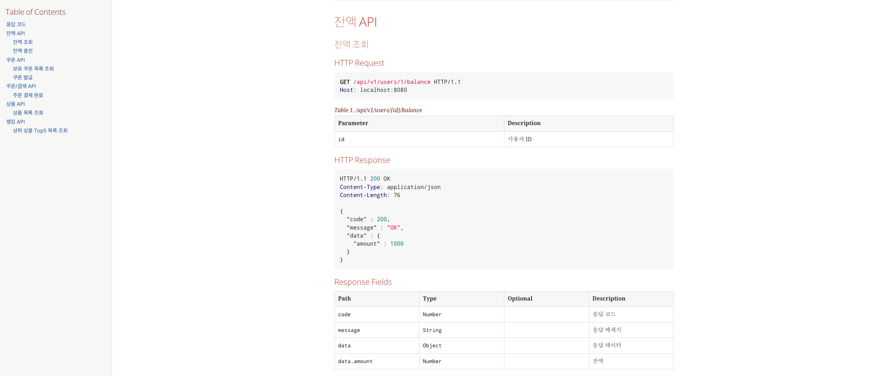
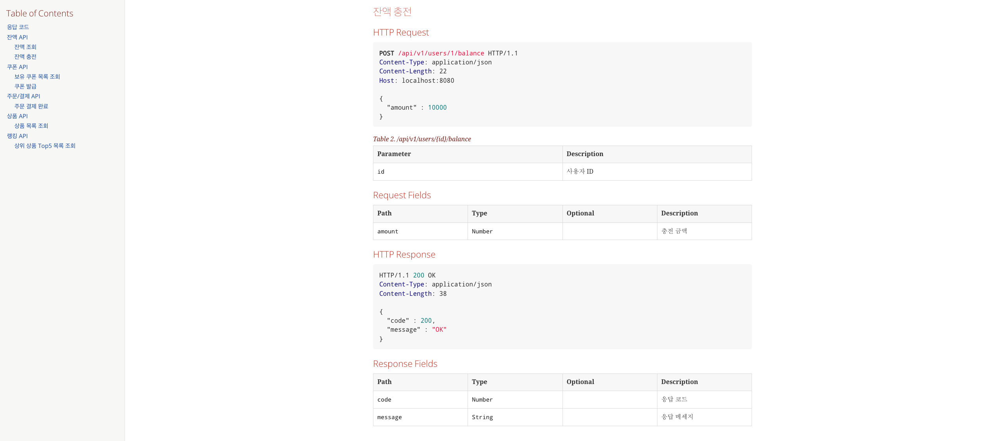
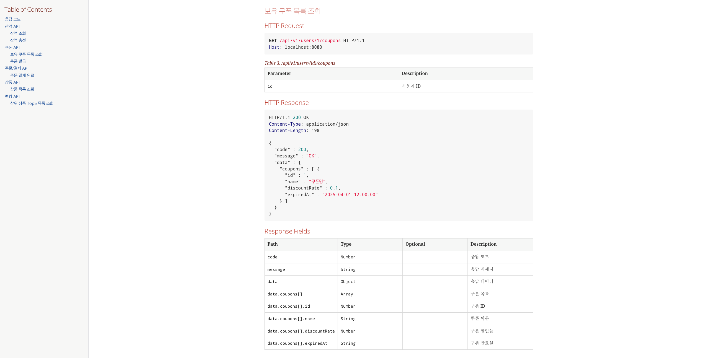
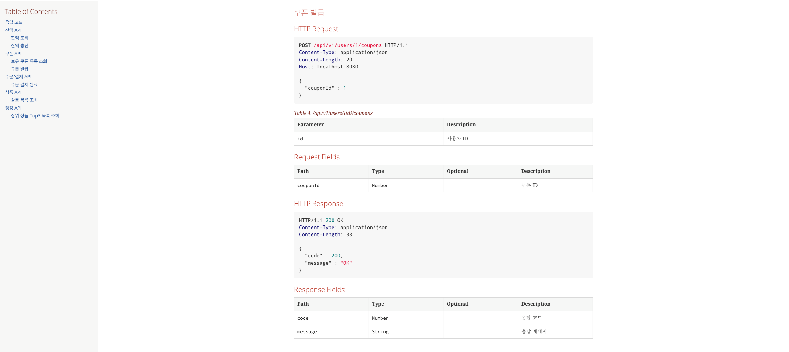
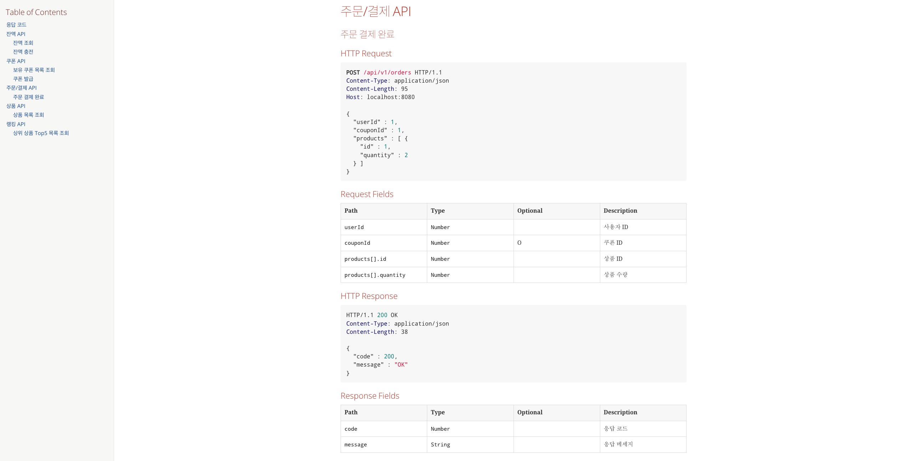
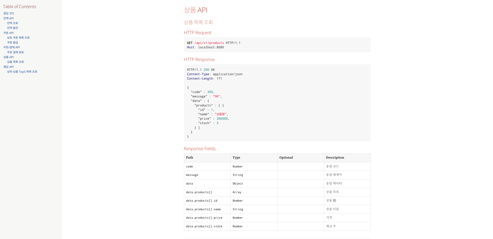
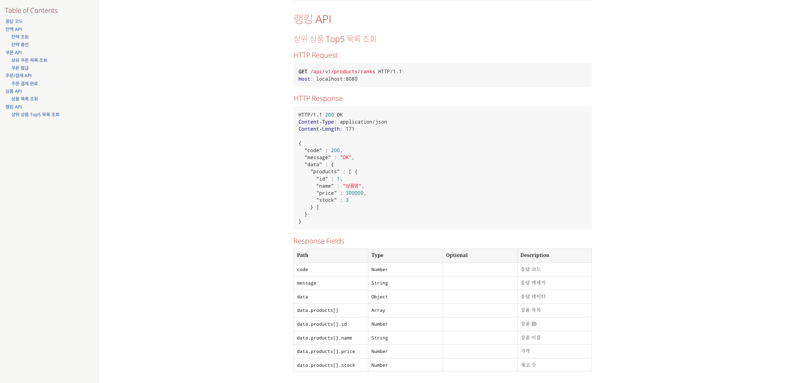

# E-커머스 서비스 Spring REST Docs

**📚 문서 목록**

+ [1️⃣ 요구사항 분석 문서](01.Requirements.md)
+ [2️⃣ 마일스톤 문서](02.Milestones.md)
+ [3️⃣ 시퀀스 다이어그램 문서](03.SequenceDiagram.md)
+ [4️⃣ ERD 문서](04.ERD.md)
+ [5️⃣ API 명세](05.ApiDocument.md)
+ [6️⃣ Spring REST Docs](06.SpringRestDocs.md)

---

👉 [항해 플러스 이커머스 Spirng REST Docs 바로가기](https://discphy.github.io/)

### 응답 코드

### 잔액 API

### 쿠폰 API

### 주문/결제 API

### 상품 API 

### 랭킹 API

